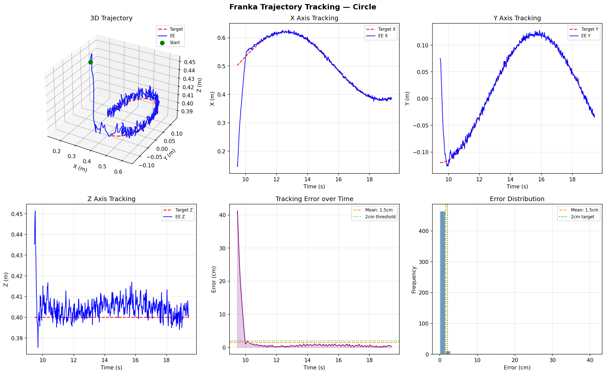
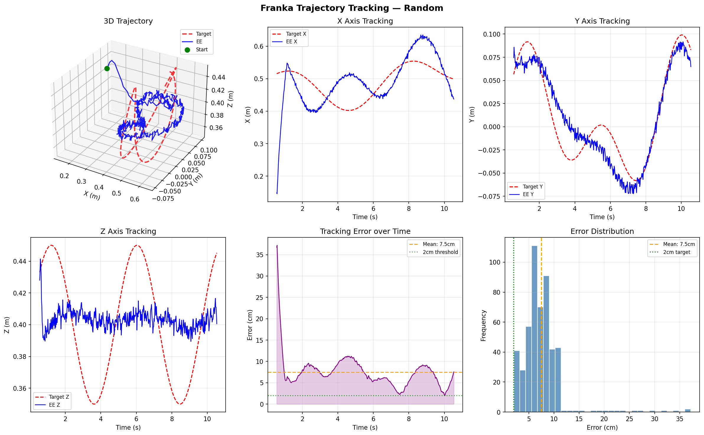

# Franka Trajectory Tracking — RL End-Effector Control

Reinforcement learning system that trains a Franka Panda 7-DOF robot arm to track moving Cartesian trajectories using PPO (Proximal Policy Optimisation) in MuJoCo.

---

## Results

| Trajectory | Mean Error | Min Error | Jerk (smoothness) |
|-----------|-----------|----------|--------------------|
| Circle    | 1.9cm     | 0.1cm    | 2.87               |
| Figure-8  | 1.8cm     | 0.1cm    | 1.35               |
| Random    | 4.8cm     | 0.2cm    | 1.43               |

Trained with 1M PPO steps per trajectory on CPU (GitHub Codespaces).

---

## Tracking Plots

### Circle


### Figure-8


### Random (Lissajous)


---

## What It Does

The agent controls all 7 joint velocities of a Franka Panda arm to keep the end effector as close as possible to a moving target point in 3D space.

```
Observation (19,):
  ee_pos     (3)  end effector position with 3mm Gaussian noise
  ee_vel     (3)  end effector velocity
  target_pos (3)  current target position on trajectory
  target_vel (3)  current target velocity (analytical derivative)
  joints     (7)  all 7 joint angles

Action (7,):
  joint velocity targets scaled to [-1, 1] then to +/-2 rad/s

Reward:
  exp(-10 x dist)        dense exponential peaks at 1.0 when perfect
  + 1.0 if dist < 2cm   precision bonus
  - 0.01 x ||action||2  control cost for smooth motion
```

---

## Trajectories

**Circle** - constant radius in horizontal plane

**Figure-8** - Lissajous curve with direction reversals (harder)

**Random** - compound Lissajous with 3D height variation (hardest)

---

## Installation

```bash
git clone https://github.com/riskerfru/franka-trajectory-tracking
cd franka-trajectory-tracking
pip install mujoco stable-baselines3 gymnasium numpy matplotlib tensorboard tqdm rich
```

---

## Usage

### Test environment
```bash
python franka_env.py
```

### Train
```bash
python train.py --traj circle --steps 1000000 --envs 4
python train.py --traj figure8 --steps 1000000 --envs 4
python train.py --traj random --steps 1000000 --envs 4
```

### Visualise
```bash
python visualise.py --traj circle --model models/ppo_circle_final
python visualise.py --traj figure8 --model models/ppo_figure8_final
python visualise.py --traj random --model models/ppo_random_final
```

### Plot tracking performance
```bash
python plot_tracking.py --traj circle --model models/ppo_circle_final
python plot_tracking.py --traj figure8 --model models/ppo_figure8_final
python plot_tracking.py --traj random --model models/ppo_random_final
```

### Monitor training
```bash
tensorboard --logdir models/logs
```

---

## Design Note

See [Design.md](Design.md) for full explanation of state, action, reward design, trajectory representation, uncertainty sources, training setup, and evaluation methodology.

---

## Project Structure

```
franka-trajectory-tracking/
├── franka_env.py        <- Gymnasium environment
├── train.py             <- PPO training
├── visualise.py         <- Evaluation episodes
├── plot_tracking.py     <- 6-panel plots with jerk metric
├── Design.md            <- Design note
├── models/
│   ├── best_model.zip
│   ├── ppo_circle_final.zip
│   ├── ppo_figure8_final.zip
│   └── ppo_random_final.zip
└── results/
    ├── tracking_circle.png
    ├── tracking_figure8.png
    └── tracking_random.png
```

---

## Author

Prajjwalit Singh - MSc Advanced Manufacturing Systems, Brunel University London