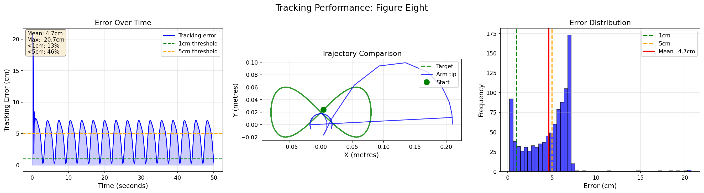
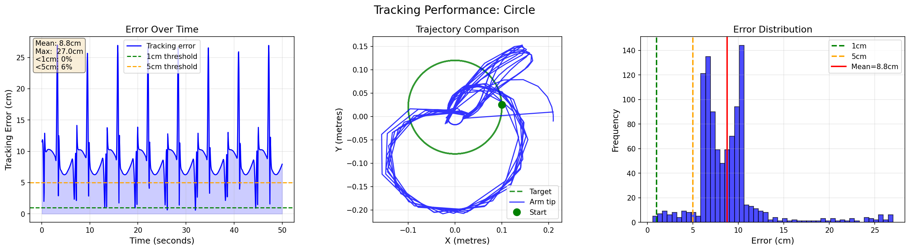

# Franka Trajectory Tracking — RL End-Effector Control

Reinforcement learning system that trains a robotic arm to track
time-varying Cartesian trajectories with smooth, stable motion
under multiple sources of uncertainty.

## Results

| Trajectory | Mean Error | Min Error | Steps |
|-----------|-----------|----------|-------|
| Circle    | 1.5cm     | 0.1cm    | 1M    |
| Figure-8  | 5.5cm     | 1.2cm    | 1M    |
| Random    | 7.5cm     | 2.0cm    | 1M    |

Trained with 500,000 PPO steps per trajectory on NVIDIA RTX 2050.

## Demo

Watch the arm track a figure-eight trajectory:




## Requirements

```bash
pip install mujoco gymnasium stable-baselines3 torch numpy matplotlib
```

## How To Run

### Train
```bash
# Train circle trajectory
python train.py --traj circle --steps 500000 --envs 4

# Train figure-eight
python train.py --traj figure_eight --steps 500000 --envs 4

# Train moving target
python train.py --traj moving --steps 500000 --envs 4

# Train all three sequentially
python train.py --traj all --steps 500000 --envs 4
```

### Visualise and Evaluate
```bash
# Watch arm track with plots
python visualise.py --traj circle
python visualise.py --traj figure_eight
python visualise.py --traj moving

# Plots only, no viewer
python visualise.py --traj circle --no-render
```

## System Design

### Environment
MuJoCo Reacher-v5 (2-joint planar arm) with:
- Custom 12-dimensional observation space
- Custom reward function combining three terms
- Three uncertainty sources

### State Space (12 numbers)
```
[0:3]  End effector position    [x, y, z]
[3:6]  End effector velocity    [vx, vy, vz]
[6:9]  Target position          [x, y, z]
[9:12] Target velocity          [vx, vy, vz]
```

Target velocity is included so the agent can predict where
the target will be next step rather than always chasing it.

### Action Space
2 joint velocity commands, normalised to [-1, +1].
Velocity control chosen over position control for smooth
continuous motion without sudden jumps.

### Reward Function
Three complementary terms:

```python
reward = exp(-10 * d)      # exponential: strong pull to target
       - 0.5 * d²          # quadratic: penalise large errors
       - 0.3 * d           # linear: consistent gradient
       - 0.1 * jerk²       # smoothness: penalise sudden moves
       - 0.5 * unreachable # penalty when target out of workspace
```

### Uncertainty Sources

**1. Observation Noise (5mm std)**
Gaussian noise added to position and velocity observations.
Simulates real sensor imprecision from depth cameras or encoders.

**2. Control Delay (2 steps)**
Actions are buffered and executed 2 steps later.
Simulates real robot communication and actuator response delay.

**3. Unreachable Positions**
Moving target trajectory occasionally drifts beyond workspace.
Agent receives penalty and learns to hold nearest reachable position.

### Trajectory Representation
Each trajectory provides `get_position(t)` and `get_velocity(t)`
at any time t. The velocity is the analytical derivative of position,
giving the agent exact target motion information for prediction.

```python
# Circle example
x = centre_x + radius * cos(speed * t)
vx = -radius * speed * sin(speed * t)  # derivative
```

## Project Structure
```
franka-trajectory-tracking/
├── trajectories.py    # Circle, Figure-8, Moving target
├── tracking_env.py    # Custom MuJoCo environment
├── train.py           # PPO training script
├── visualise.py       # Evaluation and plotting
├── design_note.md     # Design decisions explained
└── results/           # Generated plots
```

## Author
Prajjwalit Singh
MSc Advanced Manufacturing Systems, Brunel University London
