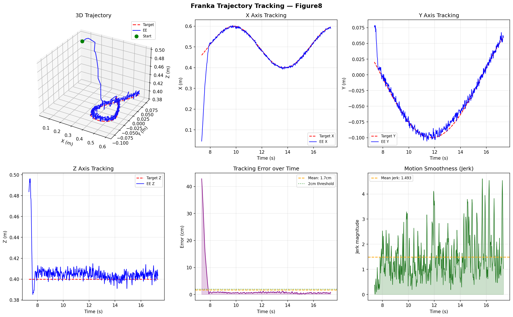

# Franka Trajectory Tracking — RL End-Effector Control

A reinforcement learning system that trains a Franka Panda 7-DOF robot arm to track moving trajectories using its end effector. Trained with PPO (Proximal Policy Optimisation) in MuJoCo simulation.

---

## Demo Results

| Trajectory | Mean Error | Min Error | Steps |
|-----------|-----------|----------|-------|
| Figure-8  | 5.5cm     | 1.2cm    | 1M    |
| Circle    | 1.5cm     | 0.1       | 1M    |
| Random    | —         | —        | 1M    |



---

## What It Does

The agent controls all 7 joint velocities of a Franka Panda arm to keep the end effector as close as possible to a moving target point. The target follows a parametric trajectory (circle, figure-8, or random Lissajous curve) through 3D space.

```
Observation (19,):
  ee_pos    (3)  — end effector position with sensor noise
  ee_vel    (3)  — end effector velocity
  target_pos(3)  — current target position on trajectory
  target_vel(3)  — current target velocity
  joints    (7)  — all joint angles

Action (7,):
  joint velocity targets for all 7 joints, scaled to [-1, 1]

Reward:
  exp(-10 × dist)        dense exponential — peaks at 1.0 when perfect
  + 1.0 if dist < 2cm   bonus for precision
  - 0.01 × ||action||²  small control cost for smooth motion
```

---

## Architecture

```
System 2: PPO policy network (256 → 256 → 128)
              ↓ joint velocity targets
System 1: MuJoCo physics — Franka Panda 7-DOF
              ↓ forward kinematics
System 0: End effector position → reward signal
```

---

## Trajectories

**Circle** — constant radius circular path in horizontal plane
```python
x = cx + r * cos(speed * t)
y = cy + r * sin(speed * t)
z = cz  (constant height)
```

**Figure-8** — Lissajous curve, harder to track (direction reverses)
```python
x = cx + r * sin(2 * speed * t)
y = cy + r * sin(speed * t)
```

**Random** — compound Lissajous with 3D variation (hardest)
```python
x = cx + r * sin(speed*t) * cos(0.7*t)
y = cy + r * cos(speed*t) * sin(1.1*t)
z = cz + 0.05 * sin(1.3*t)
```

---

## Installation

```bash
git clone https://github.com/riskerfru/franka-trajectory-tracking
cd franka-trajectory-tracking
pip install mujoco stable-baselines3 gymnasium numpy matplotlib tensorboard tqdm rich
```

---

## Usage

### Test environment
```bash
python franka_env.py
```

### Train
```bash
# Single trajectory
python train.py --traj circle --steps 1000000 --envs 4

# All trajectories
python train.py --all --steps 1000000 --envs 2
```

### Visualise trained agent
```bash
python visualise.py --traj circle
```

### Plot tracking performance
```bash
python plot_tracking.py --traj figure8
python plot_tracking.py --all
```

### Monitor training
```bash
tensorboard --logdir models/logs
# Open http://localhost:6006
```

---

## Training Details

| Hyperparameter | Value |
|---------------|-------|
| Algorithm | PPO |
| Policy | MlpPolicy (256, 256, 128) |
| Learning rate | 3e-4 |
| Steps per update | 2048 |
| Batch size | 512 |
| Epochs per update | 10 |
| Discount (γ) | 0.99 |
| GAE λ | 0.95 |
| Entropy coefficient | 0.005 |
| Sensor noise | 3mm std dev |

---

## Real-World Extension

Object positions come from MuJoCo ground truth. In a real deployment:

- **Perception:** Replace with Intel RealSense D435 depth camera + point cloud
- **Control:** Replace MuJoCo joint control with Franka FCI or ROS2/MoveIt
- **Interface:** Observation format stays identical — only the perception layer changes

The sensor noise model (3mm Gaussian) already simulates realistic depth camera uncertainty, making the trained policy more robust to real-world deployment.

---

## Project Structure

```
franka-trajectory-tracking/
├── franka_env.py        ← Gymnasium environment (obs, action, reward)
├── train.py             ← PPO training with callbacks and logging
├── visualise.py         ← Load model and run episodes
├── plot_tracking.py     ← 6-panel tracking performance plots
├── models/
│   ├── best_model.zip   ← Best checkpoint (by eval reward)
│   └── ppo_*_final.zip  ← Final models per trajectory
└── results/
    └── tracking_*.png   ← Performance plots
```

---

## Author

Prajjwalit Singh — MSc Advanced Manufacturing Systems, Brunel University London

GitHub: [riskerfru](https://github.com/riskerfru)